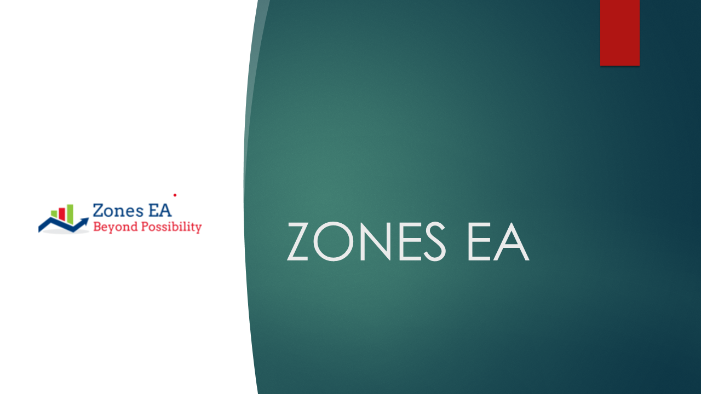
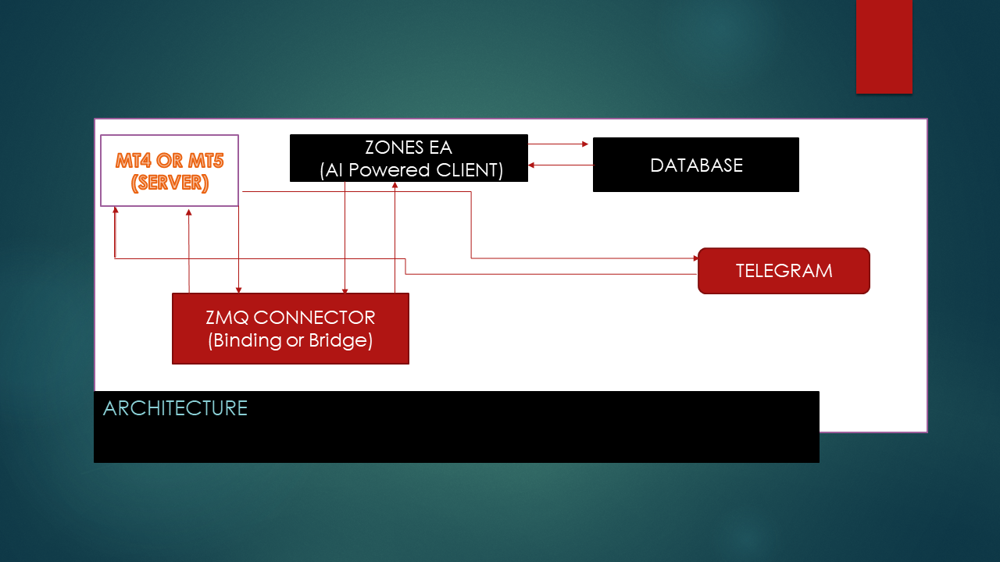
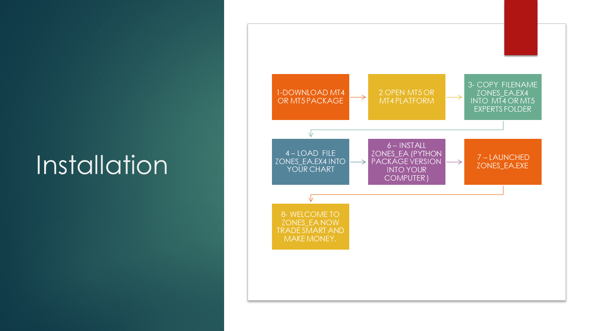

# Zones EA

     copyright (c) 2022 - 2023  

## icon

# Description :

          ZONES EA  is an ai powered professional  
          trading application using the standard platform MT4 ,MT5 and others

# Architecture

## Growing list of features:

- AI Trading Terminal
- Mysql database connection
- Telegram client
- Live screenshot
- Trade Reports
- Trade News event
- Live trade on Telegram
- VPS
- Upcoming features cryptocurrencies trading Terminal integration
  
# ________ Installations _____________
## Requirements
    - Python ~= 3.10
    - pyzmq
    - zmq
    - mysql
    - mql-zmq (library package)

# MT4 or MT5 Installation flow:

Installation flow

## Documentation

See documentation [click here](https://github.com/nguemechieu/zones_ea/blob/master/src/docs/installation.pdf)

# Linux installation:

You can run your strategies on linux through wine.

Here is a ready docker Wine:   [click here](https://hub.docker.com/docker-wine/nguemechieu/zones_ea)

# Virtual environment

# Docker installation

-     command: docker install , docker pull , docker run -d zones_ea
-     docker login 
-     docker pull zones_ea
-     docker run -d zones_ea
