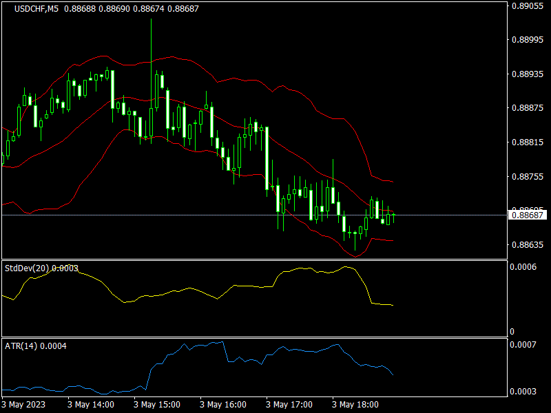
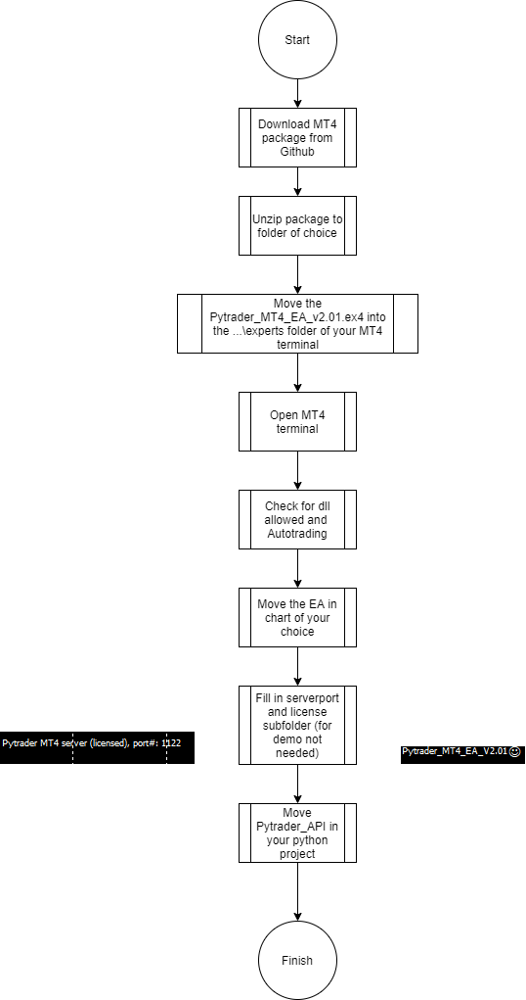

## Zones EA

# Description :
          ZONES EA  is an ai powered professional  
          trading application using the standard platform MT4 ,MT5 and others
## Drag & Drop Python Connector for MT4 & MT5

## Growing list of features:

* Python login to Metatrader5 Terminal
* Python Connection keep alive function
* Get MT5 Account Info→ Python client
* Python Client Open New Orders → MT5
 (Verify the sending, and verifying the receiving the order ,in MetaTrader5)
* Python Client can Change(take profit,stop loss) /Cancel/Open Orders → MT5
* Python Close/Partly Close Positions → MT5
* MT5 Execution info→ Python client
* MT5 → Python Get all Open orders & Positions
* MT5 → Python Get static account information
* MT5 → Python Get dynamic account info like [balance, equity, margin, free margins]
* MT5 → Python Get instrument information [pip value, max lot, tick size, tick value]
* MT5 → Python Get last tick data [date, bid, ask, vol ]
* MT5 → Python Get bar data [date, open, low, high, close, vol]
* MT5 → Python Get last X ticks array[date, bid, ask, last,vol]
* MT5 → Python Get last X bars array[date, open, low, high, close, vol]
* MT5 → Python Get indicator data from MT5 to your script - coming soon!

# Features:

- Mysql database connection
- Telegram client and Telegram Trader
- Live screenshot
- Trade News event
- VPS
- docker environment
- TCP connection
- Terminal connection

==================== Installations =============================

## Requirements

- Python >= 3.10
- pyzmq
- zmq
- mysql
- mql-zmq (library package)

## MT5 installation flow:

# MT4 python

## installation flow:

## myLib documentation

See documentation
MT5 [here](https://github.com/TheSnowGuru/PyTrader-python-mt4-mt5-trading-api-connector-drag-n-drop/blob/master/Pytrader_API%20for%20MT5.pdf)
See documentation
MT4 [here](https://github.com/TheSnowGuru/PyTrader-python-mt4-mt5-trading-api-connector-drag-n-drop/blob/master/Pytrader_API%20for%20MT4.pdf)

## Linux installation: 
You can run your strategies on linux through wine.    
Here is a ready docker + Wine:   [here](https://hub.docker.com/r/scottyhardy/docker-wine/)  

## Get the EA working for all instruments:
## MT5 python ==> Get FULL Version [here](https://www.mql5.com/en/market/product/58259)
## MT4 python ==> Get FULL Version [here](https://www.mql5.com/en/market/product/58254)

